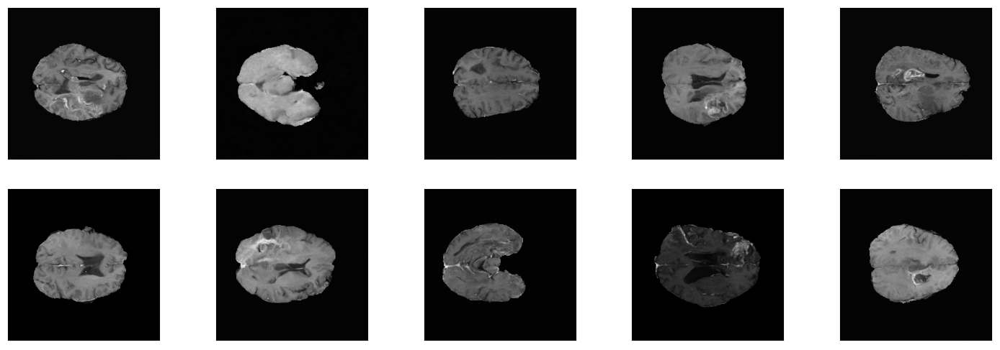
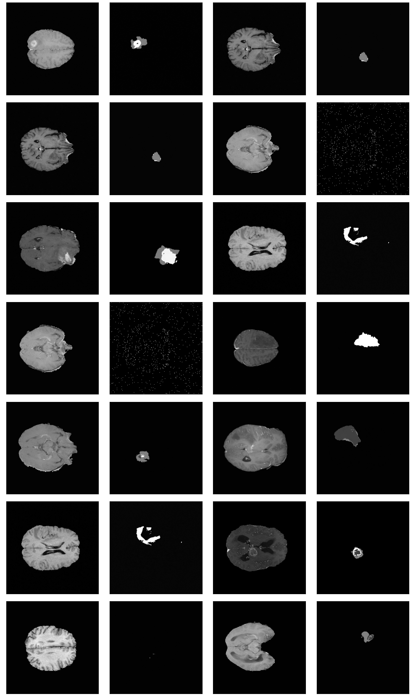

# Application of Diffusion Probabilistic Models on MRI Brain Scan Generation

    Example images from One-Channel-Model
    
This repository is based on a fork from OpenAI's [improved-diffusion](https://github.com/openai/improved-diffusion) used in their connected [paper](https://arxiv.org/abs/2102.09672) and represents the codebase for my research project at LiU. 

## Overview

Denoising diffusion probabilistic models (DDPMs) are a type of generative model that has been recently proposed as a new method for image generation tasks.
The latest released models like Dall-E 2, Midjourney or Stable Diffusion, which all leverage this new class of generative models show promising results in the synthesis of high-resolution images from text prompts.

The availability of sufficient amounts of training data, especially in the Computer Vision field, is crucial for the performance of machine learning models. To help alleviate this bottleneck when working with images e.g. in the context of classification, researchers use different data augmentation techniques like random rotations or mirroring as regularization. This often helps to reduce overfitting, allowing the model to generalize better on unseen data by using the scarce data more efficiently.

In this context researches recently also experimented with more sophisticated data augmentation methods. For example [it was shown](https://www.nature.com/articles/s41598-019-52737-x), that using synthetically created pictures by a GAN in the training process of a segmentation network for medical images, can improve the performance of the model.

Since DDPMs show comparable results to GANs when applied to image generation tasks, in this research project we will investigate their suitability in the context of their application as data augmentation tools. Therefore we will train a noise-to-image DDPM on brain MRI scans as a possible data generation candidate for improving brain tumor segmentation models.

## Data

The data used for the models in this repository are 2-D slices from patients’ 5-channel MRI brain volumes included in the [BraTS (Brain Tumor Segmentation) 2020 dataset](https://www.med.upenn.edu/cbica/brats2020/data.html).

## Experiments

We will start by first training a 2-channel model, using the T1CE-channel and the according segmentation mask. We will then proceed with a multi-channel model that will be trained on all five available channels included in the BraTS data volumes. 

All important files connected to the different experiments can be found [here](Experiments).

The following list contains an overview over the conducted BraTS-experiments and their hyperparameter settings (bs = batch size, lr = learning rate).

**1-Channel-Models:**
1. Experiment [bs=1, steps=100K, ~5 epochs, w/o BraTS loader, GeForce RTX 3060 Ti]
2. Experiment [bs=1, steps=230K, ~10 epochs, w/ BraTS loader, GeForce RTX 3060 Ti]

**2-Channel-Models (T1CE incl. Segmentation):**
1. Experiment [bs=1, steps=250K, ~10 epochs, GeForce RTX 3060 Ti]
2. Experiment [bs=6, steps=160K, ~40 epochs, GeForce RTX 3090]
3. Experiment [bs=6, steps=220K, ~65 epochs, GeForce RTX 3090, decreased lr]
4. Experiment [bs=128 (microbatching), steps=60K, ~327 epochs, GeForce RTX 3090]

**5-Channel-Model:**
1. Experiment [bs=128 (microbatching), steps=45K, ~247 epochs, GeForce RTX 3090]

## Results

The results of the experiments and a more detailed description of the theoretical background, the used resources/methods and the general usage of this repository can be found in the [report](Report/Research_Project__Diffusion_Model.pdf). 

    Example image-grid from best performing Two-Channel-Model (Experiment 4)
